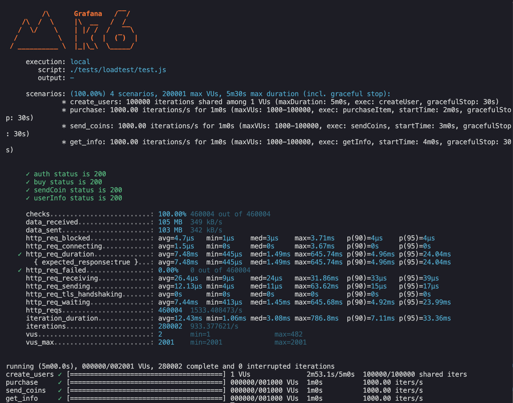

# avito_test_assignment

# Магазин мерча

## Описание
Этот сервис позволяет сотрудникам обмениваться монетками и приобретать мерч. Каждый сотрудник может:
- Просматривать список купленных товаров.
- Видеть историю переводов монеток (кто отправлял и кому отправлял монеты).
- Переводить монеты другим сотрудникам.
- Покупать мерч.

## Запуск проекта

### 1. Клонирование репозитория
```sh
git clone https://github.com/keenoobi/avito_test_assignment.git
cd avito_test_assignment 
```

### 2. Запуск через Docker Compose
```sh
docker-compose up --build
```
После этого API будет доступно по адресу `http://localhost:8080`.

### 3. Остановка контейнеров
```sh
docker-compose down
```

## Конфигурация
Все настройки хранятся в файле `.env`.

## API эндпоинты
Реализованы согласно `schema.yaml`
| Метод  | Эндпоинт          | Описание                      |
|--------|------------------|------------------------------|
| POST   | /api/auth        | Регистрация пользователя  |
| POST   | /api/auth        | Авторизация (выдача JWT)    |
| GET    | /api/buy/{item}  | Покупка товара              |
| POST   | /api/sendCoin    | Передача монет другому пользователю |
| GET    | /api/info        | Получение информации о кошельке, инвентаре, и переводе денег |

## Тестирование
Запуск тестов:
```go
go test -v ./...
```

Запуск покрытия:
```go
go test ./... -coverprofile=coverage.out  
go tool cover -html=coverage.out -o coverage.html
```
Затем можно открыть файл `coverage.html`

## Линтинг
Запуск линтера в корневой папке проекта:
```
golangci-lint run
```

## Нагрузочное тестирование
Запуск тестов с **k6** (должен быть запущен `docker-compose`):
```sh
docker exec -it k6 k6 run /scripts/test.js
```
## Работа под нагрузкой
Сервис поддерживает до **100k** сотрудников и обеспечивает **RPS — 1k**, **SLI времени ответа — 50 мс**, **SLI успешности — 99.99%**.

Проверено с помощью утилиты `k6`.



Скрипт, которым было проведено тестирование лежит в `tests/loadtest/test.js`

## Стек технологий
- **Язык:** Go
- **База данных:** PostgreSQL
- **Аутентификация:** JWT
- **Тестирование:** Unit, E2E
- **Контейнеризация:** Docker, Docker Compose
